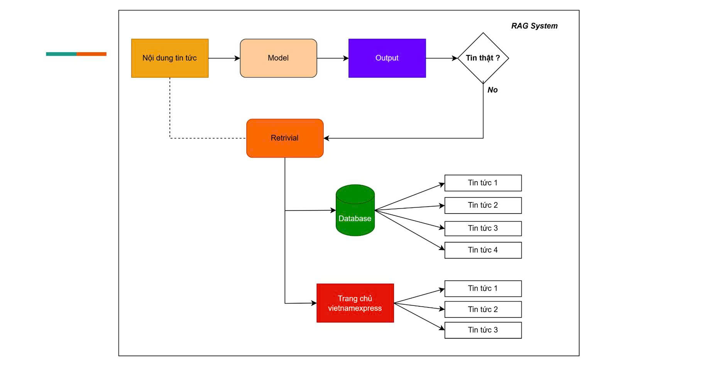
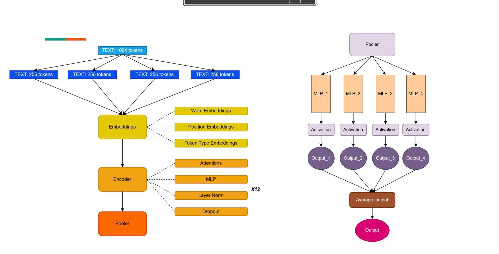
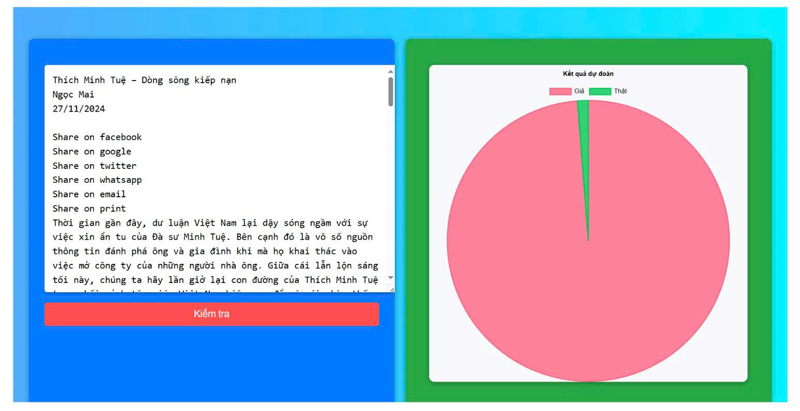

# 🚀 XÂY DỰNG HỆ THỐNG PHÁT HIỆN TIN TỨC THẬT GIẢ
Xây dựng hệ thống phát hiện các nội dung thật giả dựa vào các cái tài liệu và nguồn dữ liệu Tiếng Việt  
Hệ thống sử dụng mô hình PhoBERT phát hiện tin tức giả kèm hệ thống RAG để tìm kiếm các tài liệu liên quan  

# 🔧 XÂY DỰNG NGUỒN DỮ LIỆU
+ Nguồn dữ liệu tin thật được thu thập từ: thanhnien.vn, vnexpress.net, vietnamnet.vn, ...  
+ Nguồn dữ liệu tin giả được thu thập từ: viettan.org, danlambao.org, ...  

# 🔧 XÂY DỰNG MÔ HÌNH

Sử dụng PhoBERT để phát hiện tin tức thật giả, nhưng mô hình này chỉ nhận tối đa 256 tokens  
cho một lần inference, vì vậy tôi sử dụng kỹ thuật trung bình cộng dự đoán các patch để dự đoán  

# 🔧 CÁC THƯ VIỆN CẦN QUAN TRỌNG CÀI ĐẶT
torch  
flask  
transformers  
numpy  
pandas  
sklearn  
nltk  

# 📁 TỔ CHỨC CẤU TRÚC THƯ MỤC DỮ LIỆU
/checkpoints: lưu trữ trọng số mô hình  
/datacsv: lưu trữ dữ liệu news và fakenews dưới dạng file csv  
/utils: chưa các hàm thực hiện các chức năng nhất định  

# ⚡ Quick Start

python main.py  
